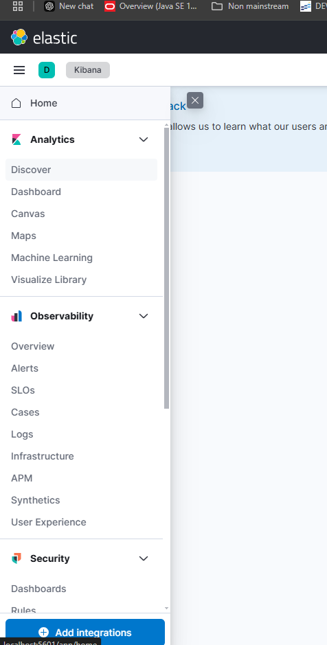
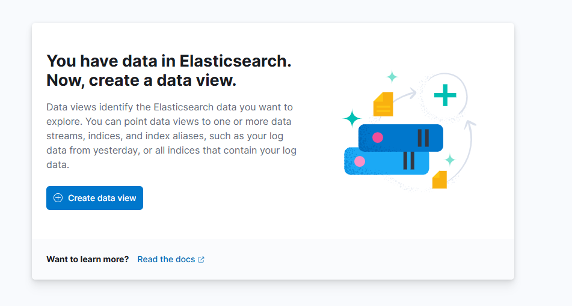
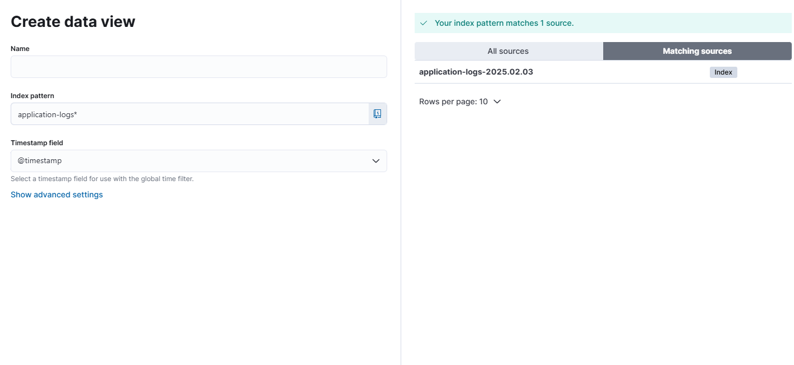

# Kibana로 로그 시각화하기

Kibana는 데이터 조회와 시각화를 위한 애플리케이션이다. 

Elasticsearch와 함께 사용되며, Elasticsearch에 저장된 데이터를 조회하고 시각화할 수 있다. 이번에는 Kibana를 사용하여 로그를 시각화하는 방법을 알아보겠다.

kibana 또한 도커 컨테이너로 띄운다. 다음과 같이 docker-compose.yml을 작성하면 된다.

```yml
services:
  elasticsearch:
    image: docker.elastic.co/elasticsearch/elasticsearch:8.10.0
    container_name: elasticsearch
    environment:
      - discovery.type=single-node
      - xpack.security.enabled=false
      - xpack.security.http.ssl.enabled=false
    ports:
      - 9200:9200
    networks:
      - elk
    restart: unless-stopped

  logstash:
    image: docker.elastic.co/logstash/logstash:8.10.0
    container_name: logstash
    ports:
      - "5044:5044"
      - "9600:9600"
    volumes:
      - ./logstash.conf:/usr/share/logstash/pipeline/logstash.conf
    networks:
      - elk
    restart: unless-stopped

  kibana:
    image: kibana:8.10.1
    container_name: kibana
    restart: unless-stopped
    networks:
      - elk
    ports:
      - "5601:5601"
    environment:
      - ELASTICSEARCH_HOSTS=http://elasticsearch:9200

networks:
  elk:
    driver: bridge
```

위와 같이 docker-compose.yml을 작성하고 `docker-compose up -d` 명령어를 실행하면 kibana가 실행된다.

그 후에 브라우저에서 `http://localhost:5601`로 접속하면 kibana 화면이 나타난다. 거기서 왼쪽 상단의 토글을 열고 Discover를 클릭한다.



그리고 Create data view 버튼을 클릭한다.



그리고 index pattern을 설정한다. index pattern은 Elasticsearch에 저장된 데이터를 조회할 때 사용하는 패턴이다. 

엘라스틱서치에 저장된 데이터의 인덱스가 오른쪽에 나타나는데, 이를 참고해서 작성하면 된다. 지금 사진의 예시에서는 application-logs 라는 이름에 날짜를 붙여 데이터를 저장하고 있는데, 모든 날짜의 로그를 확인하기 위한 view를 생성하려고 하면 `application-logs-*`로 작성하면 된다.



타임스탬프는 @timestamp로 설정해주자.

