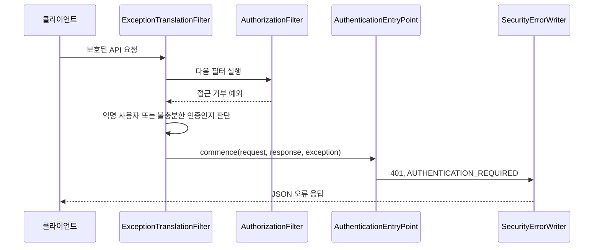

# Spring Security AuthenticationEntryPoint의 개념과 활용

**`AuthenticationEntryPoint`는 보호된 자원에 접근하기 위해 인증이 필요할 때, 클라이언트에게 어떤 응답을 보낼지 결정하는 전략이다.** 로그인 화면으로 보낼 수도 있고, 인증 방식에 맞는 챌린지 헤더를 보낼 수도 있으며, 프론트엔드가 처리할 오류 응답을 만들 수도 있다. 이름에 `Authentication`이 들어가지만 사용자 이름과 비밀번호를 검사하는 인증 서비스 자체는 아니다. [공식 인터페이스 문서](https://docs.spring.io/spring-security/reference/api/java/org/springframework/security/web/AuthenticationEntryPoint.html)

이 글은 Spring MVC와 세션 인증을 사용하는 애플리케이션의 `AuthenticationSecurityHandlers.kt`를 사례로 설명한다. 차량·계약 관리 시스템에서 가져온 코드지만 해당 업무를 몰라도 읽을 수 있다. 내용은 Servlet 기반 Spring Security를 대상으로 하며, WebFlux의 대응 인터페이스는 `ServerAuthenticationEntryPoint`다.

## 1. 인증, 인가, 인증 시작 응답을 구분한다

| 개념 | 질문 | 예시 |
| --- | --- | --- |
| 인증(Authentication) | 누구의 요청인가? | 비밀번호 확인, 세션에서 로그인 사용자 확인 |
| 인가(Authorization) | 이 사용자가 이 작업을 할 수 있는가? | 계약 조회 권한 확인 |
| 인증 시작 응답 | 인증이 필요한 클라이언트에게 어떻게 알릴 것인가? | 로그인 페이지 이동, 401 JSON 응답 |

예를 들어 로그인하지 않은 사용자가 계약 목록 API를 호출했다고 하자. 서버는 요청을 허용할 수 없지만, 대응 방식은 클라이언트에 따라 다르다.

- 서버가 HTML 화면을 제공한다면 로그인 페이지로 리다이렉트할 수 있다.
- 별도 프론트엔드가 API를 호출한다면 JSON 오류를 반환하고 화면 전환은 프론트엔드가 결정할 수 있다.
- HTTP Basic이나 Bearer 인증이라면 해당 방식의 챌린지 응답을 제공해야 한다.

`AuthenticationEntryPoint`는 이 응답 정책을 보안 판단과 분리한다. `commence`는 “여기서 비밀번호 검증을 시작하라”는 뜻으로 읽기보다, “클라이언트가 필요한 인증을 진행하도록 응답하라”는 의미로 이해하면 좋다.

## 2. 실제 구현: 인증 필요 상태를 JSON으로 알린다

사례의 구현은 짧다.

```kotlin
class RestAuthenticationEntryPoint(
    private val errorWriter: SecurityErrorWriter,
) : AuthenticationEntryPoint {
    override fun commence(
        request: HttpServletRequest,
        response: HttpServletResponse,
        authException: AuthenticationException,
    ) {
        errorWriter.write(
            request,
            response,
            HttpStatus.UNAUTHORIZED,
            "AUTHENTICATION_REQUIRED",
        )
    }
}
```

각 인수의 역할은 다음과 같다.

| 인수 | 역할 | 이 구현의 사용 방식 |
| --- | --- | --- |
| `request` | 실패한 HTTP 요청 | 경로와 요청 식별자 조회 |
| `response` | 클라이언트에 보낼 HTTP 응답 | 상태, 콘텐츠 유형, 본문 작성 |
| `authException` | 인증이 필요하다고 판단한 원인 | 구체적인 예외 문구를 노출하지 않으므로 직접 사용하지 않음 |

`SecurityErrorWriter`는 상태를 401로 지정하고 `application/json` 본문을 직렬화한다. 예시 응답은 다음과 같다. 시각과 식별자는 설명용 값이다.

```http
HTTP/1.1 401 Unauthorized
Content-Type: application/json
X-Request-Id: 8077651a-049f-4728-b985-e09d5bec522e
```

```json
{
  "timestamp": "2026-09-22T01:00:00Z",
  "status": 401,
  "code": "AUTHENTICATION_REQUIRED",
  "path": "/api/v1/finance-contracts",
  "requestId": "8077651a-049f-4728-b985-e09d5bec522e",
  "fieldErrors": []
}
```

`X-Request-Id` 헤더와 식별자는 앞서 실행되는 요청 로깅 필터가 준비한다. EntryPoint가 모든 추적 정보를 직접 만드는 구조는 아니다.

이 코드는 사용자를 인증하거나 세션을 만들지 않고, 로그인 페이지로 리다이렉트하지도 않는다. 인증이 필요하다는 사실을 전달하는 데 집중한다.

## 3. 누가 EntryPoint를 호출하는가?

대표적인 호출자는 `ExceptionTranslationFilter`다. 이 필터는 자신이 감싼 이후 처리에서 올라온 Spring Security 예외를 HTTP 응답 처리로 연결한다. 보안 규칙을 판정하는 필터와 그 실패를 응답으로 바꾸는 필터의 역할이 다르다. [Spring Security 필터 구조](https://docs.spring.io/spring-security/reference/servlet/architecture.html)

다음은 인증이 없는 GET 요청이 권한 검사까지 도달한 경우의 개념적인 흐름이다. 전체 필터 목록을 표현한 그림은 아니다.



중요한 점은 인가 단계의 `AccessDeniedException`에서도 EntryPoint가 호출될 수 있다는 것이다. 익명 사용자라면 먼저 인증해야 하므로 인증 시작 응답을 선택한다. 확인한 Spring Security 6.5 계열 구현은 remember-me 인증 상태의 접근 거부에도 추가 인증을 요청하는 경로를 사용한다. 충분히 인증된 사용자의 접근 거부는 `AccessDeniedHandler`로 보낸다. [ExceptionTranslationFilter 소스](https://github.com/spring-projects/spring-security/blob/6.5.x/web/src/main/java/org/springframework/security/web/access/ExceptionTranslationFilter.java)

따라서 예외 클래스 이름만 보고 “AccessDeniedException이면 항상 403”이라고 판단하면 안 된다. 현재 인증 상태와 처리 경로도 봐야 한다.

## 4. 설정에 연결해야 실제로 사용된다

구현 클래스를 작성하는 것만으로 모든 요청에 적용되지는 않는다. 이 사례는 `SecurityFilterChain` 구성에서 인스턴스를 만들고 명시적으로 등록한다.

```kotlin
val authenticationEntryPoint = RestAuthenticationEntryPoint(errorWriter)
val accessDeniedHandler = RestAccessDeniedHandler(errorWriter)

http.exceptionHandling {
    it.authenticationEntryPoint(authenticationEntryPoint)
        .accessDeniedHandler(accessDeniedHandler)
}
```

이와 함께 현재 설정은 다음 선택을 하고 있다.

- `formLogin`과 `httpBasic`은 비활성화하고 별도 로그인 API를 사용한다.
- 로그인 API와 CSRF 토큰 조회는 익명 접근을 허용한다.
- 요청 캐시는 비활성화한다. 로그인 후 원래 요청을 서버가 복원하는 흐름에 의존하지 않는다.
- 세션은 필요한 경우 생성한다. JSON API라고 해서 무상태 인증을 사용하는 것은 아니다.
- 세션 쿠키를 사용하는 구성에서 CSRF 보호를 유지한다.

이 설정을 다른 서비스에 복사하기보다는 인증 방식과 화면 구성을 먼저 결정해야 한다. EntryPoint를 JSON으로 바꾸는 것과 세션·CSRF·로그인 처리 방식을 바꾸는 것은 별개의 작업이다.

## 5. AccessDeniedHandler와 AuthenticationFailureHandler는 무엇이 다른가?

| 구성 요소 | 주된 역할 | 사례 |
| --- | --- | --- |
| `AuthenticationEntryPoint` | 필요한 인증을 진행하도록 응답 | 미인증 API 요청에 401 |
| `AccessDeniedHandler` | 접근 거부를 응답으로 변환 | 로그인했지만 권한이 없으면 403 |
| `AuthenticationFailureHandler` | 이를 사용하는 인증 필터의 인증 시도 실패 처리 | 폼 로그인 비밀번호 오류 |
| MVC 예외 처리기 | 컨트롤러·애플리케이션 실행의 예외를 HTTP 응답으로 변환 | 직접 구현한 로그인 API의 업무 예외 |

`AuthenticationFailureHandler`는 인증 시도 실패 시 사용하는 전략이다. 다만 인증 방식에 따라 EntryPoint를 통해 실패 응답을 만드는 경우도 있으므로 “잘못된 자격증명은 반드시 FailureHandler”라는 일대일 대응은 아니다. HTTP Basic은 실패 시 EntryPoint를 활용한다. [FailureHandler API](https://docs.spring.io/spring-security/reference/api/java/org/springframework/security/web/authentication/AuthenticationFailureHandler.html), [HTTP Basic 처리 흐름](https://docs.spring.io/spring-security/reference/servlet/authentication/passwords/basic.html)

이 프로젝트의 로그인은 컨트롤러가 애플리케이션 인증 기능을 직접 호출한다. 그 과정의 `AuthenticationFailedException`은 MVC의 `AuthenticationExceptionHandler`가 `401 + AUTHENTICATION_FAILED`로 변환한다. 이름이 비슷해도 Spring Security의 `AuthenticationException`과 동일한 타입이 아니다.

또한 `RestAccessDeniedHandler`는 비밀번호 변경이 필수인 경우 `403 + PASSWORD_CHANGE_REQUIRED`, 그 외 접근 거부는 `403 + ACCESS_DENIED`를 반환한다. 로그인 화면으로 다시 보내는 것만으로 해결되지 않는 상태를 구별한 것이다.

## 6. 모든 401과 403이 EntryPoint를 통과하지는 않는다

현재 코드에서 확인한 처리 경로는 다음과 같다.

| 상황 | 응답 | 작성 주체 |
| --- | --- | --- |
| 보호된 API에 인증 없이 접근 | 401, `AUTHENTICATION_REQUIRED` | `RestAuthenticationEntryPoint` |
| 로그인한 사용자에게 업무 권한이 없음 | 403, `ACCESS_DENIED` | `RestAccessDeniedHandler` |
| 업무 접근 전 비밀번호 변경이 필요함 | 403, `PASSWORD_CHANGE_REQUIRED` | `RestAccessDeniedHandler` |
| 로그인 시 자격증명 검증 실패 | 401, `AUTHENTICATION_FAILED` | MVC 인증 예외 처리기 |
| 절대 세션 만료를 감지 | 401, `SESSION_EXPIRED` | `AbsoluteSessionTimeoutFilter` |
| 세션 사용자를 더 이상 사용할 수 없음 | 401, `ACCOUNT_UNAVAILABLE` | `ActiveAppUserFilter` |

사용자 정의 세션 필터는 세션을 무효화한 뒤 공통 오류 작성기를 호출하고 즉시 반환한다. 모든 실패를 EntryPoint에 모으는 대신 응답 형식을 공유한다.

또한 세션이 이미 저장소에서 사라져 익명 요청으로 보이면, 서버가 구체적인 만료 원인을 알 수 없어 `AUTHENTICATION_REQUIRED`가 나올 수 있다. 모든 로그인 해제를 `SESSION_EXPIRED` 하나로 관측할 수 있는 것은 아니다.

CSRF도 별도 경로다. `CsrfFilter`가 먼저 토큰 오류를 발견하면 403으로 끝날 수 있으므로, 미인증 POST 요청이 반드시 401이라는 가정은 틀릴 수 있다. EntryPoint를 점검할 때는 GET 요청을 쓰거나 유효한 CSRF 조건을 준비해 확인하려는 실패 원인을 분리한다. [공식 CSRF 문서](https://docs.spring.io/spring-security/reference/servlet/exploits/csrf.html)

## 7. 좋은 활용 방안

### API의 실패 응답을 일관되게 만든다

여러 EntryPoint·접근 거부 핸들러·사용자 정의 필터가 동일한 JSON 계약을 사용하면 클라이언트가 코드로 분기할 수 있다. 이 사례처럼 응답 작성기를 공유하되, 실패 종류에 맞는 상태와 코드를 선택하는 책임은 각 처리기에 둔다.

JSON API에 로그인 HTML을 반환하면 클라이언트가 JSON 파싱 실패로 원래 문제를 놓칠 수 있다. API 경로에서는 명시적인 오류 응답을, HTML 화면에서는 로그인 이동을 사용하는 식으로 클라이언트의 기대에 맞춘다.

### 사용자 안내와 서버 진단을 분리한다

`authException.message`를 그대로 화면에 내보내지 말고 안정적인 코드를 전달한다. 로그인 안내의 언어와 표현은 프론트엔드에서 정하고, 서버는 요청 식별자로 실패를 추적한다.

현재 프론트엔드는 401 중 `AUTHENTICATION_REQUIRED`, `SESSION_EXPIRED`, `ACCOUNT_UNAVAILABLE`를 세션 종료로 취급한다. 반면 `PASSWORD_CHANGE_REQUIRED`는 로그인 사용자 상태를 유지하면서 비밀번호 변경 필요 상태로 갱신한다. 서버의 구분이 클라이언트의 다음 행동으로 이어지는 예다.

로그인 복귀 후 원래 화면을 복원할지, 여러 동시 401을 하나의 안내로 합칠지는 화면 정책으로 정할 수 있다. 결제·등록 같은 쓰기 요청을 인증 복구 후 자동 재전송하려면 멱등성과 중복 처리까지 별도로 설계해야 한다.

### 인증 방식의 표준 동작을 보존한다

세션 기반 JSON 응답 예제를 Basic·Bearer 인증에 그대로 적용하지 않는다. Basic과 Bearer의 EntryPoint는 `WWW-Authenticate` 같은 인증 챌린지를 구성한다. Bearer 토큰 API라면 Resource Server의 표준 처리기를 우선 검토하고, JSON을 추가할 때도 기존 프로토콜 헤더와 상태를 보존한다. [BearerTokenAuthenticationEntryPoint API](https://docs.spring.io/spring-security/reference/api/java/org/springframework/security/oauth2/server/resource/web/BearerTokenAuthenticationEntryPoint.html)

웹 화면과 API가 섞인 서비스에서는 요청 매처에 따라 EntryPoint를 선택하거나 별도 `SecurityFilterChain`을 구성할 수 있다. 여러 체인을 사용하면 먼저 매칭된 체인이 선택되므로 순서와 보호 범위를 함께 확인한다. [Spring Security 체인 선택 구조](https://docs.spring.io/spring-security/reference/servlet/architecture.html)

### 필터 예외 처리 범위를 명시한다

`ExceptionTranslationFilter` 앞에 있는 사용자 정의 필터가 자기 로직에서 예외를 던진다고 뒤쪽의 예외 변환 필터가 자동으로 잡는 것은 아니다. 호출 스택에서 감싸고 있는 범위 안의 예외만 처리할 수 있다.

사용자 정의 인증 필터를 작성한다면 배치 순서와 실패 처리 계약을 확인하고, 필요한 경우 해당 필터의 실패 처리기에서 EntryPoint를 호출한 뒤 요청 처리를 끝낸다. 이미 오류 응답을 작성하고 나서 `chain.doFilter`를 계속 호출하거나, 같은 응답에 JSON과 `sendError`를 중복 적용하지 않도록 한다.

MVC의 `@RestControllerAdvice`도 필터에서 직접 발생한 예외를 자동으로 모두 처리하는 전역 장치가 아니다. 공통 오류 형식이 필요하면 필터와 MVC 양쪽에서 공통 직렬화 규칙을 사용하되 처리 경계를 분리하는 편이 명확하다.

## 8. 테스트는 실제 필터 연결까지 확인한다

`commence()`를 직접 호출하는 테스트는 상태와 JSON 작성만 확인한다. 보안 설정에 등록됐는지, 익명 요청에서 호출되는지는 실제 필터를 포함한 웹 테스트가 필요하다.

현재 `FinanceContractSecurityTest`는 실제 보안 구성을 가져오고 업무 조회 포트를 mock으로 대체해 다음을 확인한다.

```kotlin
mockMvc.get("/api/v1/finance-contracts").andExpect {
    status { isUnauthorized() }
    jsonPath("$.code") { value("AUTHENTICATION_REQUIRED") }
    jsonPath("$.message") { doesNotExist() }
    jsonPath("$.requestId") { isNotEmpty() }
}
verifyNoInteractions(query)
```

업무 포트 미호출 검증은 단순히 401을 만들었는지를 넘어 보호 대상 로직에 도달하기 전에 차단됐는지 확인한다.

다른 서비스에 적용할 때의 권장 검증 항목은 다음과 같다. 아래 전체를 현재 테스트가 모두 보장한다는 뜻은 아니다.

- 미인증 GET은 기대한 401·코드·JSON 형식이며 로그인 리다이렉트가 없는가?
- 인증됐지만 권한 없는 요청은 403이고 업무 기능이 실행되지 않는가?
- 권한 있는 정상 요청은 통과하는가?
- POST의 권한 검증에서는 유효한 CSRF 토큰을 제공해 실패 원인을 분리했는가?
- 세션 만료, 로그인 실패, 비밀번호 변경 필요 상태가 각각 의도한 처리기로 연결되는가?
- 요청 식별자가 헤더·본문·로그에서 연결되는가?
- Basic·Bearer 방식이라면 챌린지 헤더도 검증하는가?

## 9. 자주 하는 오해

| 오해 | 확인할 기준 |
| --- | --- |
| EntryPoint가 로그인 API다 | 인증 필요 시의 HTTP 응답 전략이며 자격증명 검증과 별개다. |
| EntryPoint는 반드시 401을 반환한다 | 인터페이스는 응답 정책을 확장하는 지점이며 구현에 따라 리다이렉트나 다른 응답도 가능하다. |
| 모든 인증 실패가 한 EntryPoint로 모인다 | 인증 방식, 필터 순서, 직접 응답하는 필터와 MVC 처리기를 확인해야 한다. |
| 403은 항상 역할 부족이다 | CSRF나 추가 보안 조건도 403을 만들 수 있다. |
| JSON API는 CSRF를 꺼야 한다 | 세션 쿠키 등 자격증명 전달 방식을 기준으로 판단해야 한다. |
| 핸들러 단위 테스트면 충분하다 | 실제 SecurityFilterChain의 등록과 분기까지 별도로 검증해야 한다. |

## 10. 코드 근거와 확인 범위

2026년 9월 22일 작업 트리의 관련 구현과 테스트를 읽고 Spring 공식 문서·소스를 확인했다. 코드 링크는 기준 커밋 `6a1963a31b1d9820b9d5baf87b9ac31a53b6f8dc`에 고정했다. 테스트를 새로 실행하거나 인증 동작을 변경하지 않았다.

| 코드 | 읽을 내용 |
| --- | --- |
| [AuthenticationSecurityHandlers.kt](https://github.com/icar-mobility/icar-erp/blob/6a1963a31b1d9820b9d5baf87b9ac31a53b6f8dc/backend/src/main/kotlin/com/icar/erp/authentication/adapter/in/security/AuthenticationSecurityHandlers.kt) | EntryPoint와 접근 거부 핸들러의 역할 분리 |
| [SessionSecurityConfiguration.kt](https://github.com/icar-mobility/icar-erp/blob/6a1963a31b1d9820b9d5baf87b9ac31a53b6f8dc/backend/src/main/kotlin/com/icar/erp/authentication/adapter/in/security/SessionSecurityConfiguration.kt) | 등록 위치, 세션·CSRF·요청 캐시와 필터 설정 |
| [SecurityErrorWriter.kt](https://github.com/icar-mobility/icar-erp/blob/6a1963a31b1d9820b9d5baf87b9ac31a53b6f8dc/backend/src/main/kotlin/com/icar/erp/authentication/adapter/in/security/SecurityErrorWriter.kt) | 공통 JSON 응답 직렬화 |
| [SessionSecurityFilters.kt](https://github.com/icar-mobility/icar-erp/blob/6a1963a31b1d9820b9d5baf87b9ac31a53b6f8dc/backend/src/main/kotlin/com/icar/erp/authentication/adapter/in/security/SessionSecurityFilters.kt) | 세션·계정 상태에 따른 직접 오류 응답 |
| [AuthenticationExceptionHandler.kt](https://github.com/icar-mobility/icar-erp/blob/6a1963a31b1d9820b9d5baf87b9ac31a53b6f8dc/backend/src/main/kotlin/com/icar/erp/authentication/adapter/in/web/AuthenticationExceptionHandler.kt) | 로그인 업무 실패의 MVC 처리 |
| [FinanceContractSecurityTest.kt](https://github.com/icar-mobility/icar-erp/blob/6a1963a31b1d9820b9d5baf87b9ac31a53b6f8dc/backend/src/test/kotlin/com/icar/erp/finance/contract/adapter/in/web/FinanceContractSecurityTest.kt) | 실제 보안 구성으로 미인증·권한 부족·CSRF 차단 검증 |
| [AuthenticationProvider.tsx](https://github.com/icar-mobility/icar-erp/blob/6a1963a31b1d9820b9d5baf87b9ac31a53b6f8dc/frontend/src/features/authentication/AuthenticationProvider.tsx) | 오류 코드에 따른 프론트엔드 인증 상태 처리 |

공식 문서의 현재 버전은 프로젝트의 의존성 버전과 다를 수 있다. 개념은 공식 문서를 참고하고, 예외 변환의 구체적인 분기는 Spring Security 6.5 계열 소스와 함께 확인했다. 본문의 일반 활용 제안과 이 프로젝트에서 실제 확인한 구현을 구분해 적용해야 한다.
