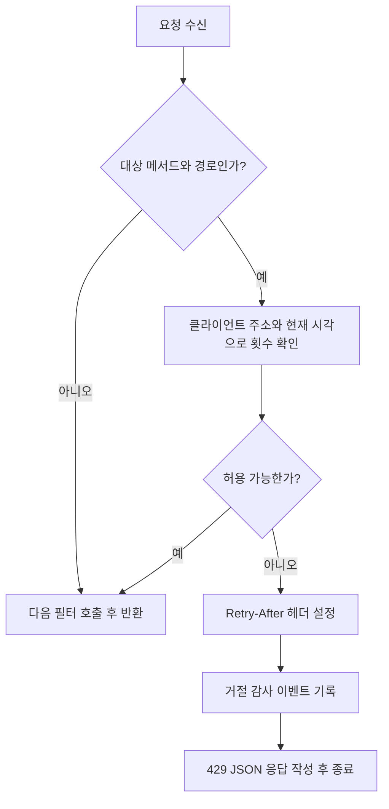

# OncePerRequestFilter 구현과 인증 요청 제한의 설계 원칙

**`OncePerRequestFilter`를 구현할 때 중요한 것은 처리할 요청, 다음 필터로 넘길 조건, 응답을 끝낼 조건을 명확히 나누는 것이다.** 여기에 요청 재디스패치, 여러 스레드의 동시 접근, 실제 배포 구조까지 고려해야 필터의 동작 범위를 정확히 설명할 수 있다.

이 글은 `AuthenticationEndpointRateLimitFilter.kt`를 사례로 한다. 이 필터는 Spring MVC 기반 웹 애플리케이션에서 로그인 요청과 CSRF 토큰 조회가 과도하게 들어오는 것을 제한한다. 프로젝트의 업무 기능을 몰라도 이해할 수 있도록 필터의 기본 개념부터 구현과 개선 판단 기준까지 정리했다.

## 1. 필터와 요청 제한의 기본 개념

웹 요청은 곧바로 컨트롤러로 들어가지 않는다. 먼저 여러 Servlet 필터를 통과하며 로깅, 보안 검사 등의 처리가 수행된다.

| 개념 | 의미 |
| --- | --- |
| `FilterChain` | 다음 필터와 최종 요청 처리기로 이어지는 호출 경로 |
| `doFilterInternal` | `OncePerRequestFilter`를 상속한 클래스가 구현하는 HTTP 처리 메서드 |
| 디스패치(dispatch) | 컨테이너가 요청 처리를 실행하는 단계. 최초 요청, 비동기 재개, 오류 처리 등이 있다. |
| rate limit | 정해진 기준과 시간 범위에 따라 요청 수를 제한하는 정책 |
| CSRF | 브라우저가 자동으로 보내는 로그인 쿠키 등을 악용한 위조 요청. 토큰 검증은 이를 막는 수단 중 하나다. |
| 고정 시간창(fixed window) | 일정한 길이의 구간마다 허용 횟수를 세는 방식 |

로그인 API는 익명 사용자도 호출할 수 있어야 한다. 그렇다고 횟수 제한까지 없어야 하는 것은 아니다. 비밀번호 검사나 세션 준비 같은 작업에 진입하기 전에 과도한 요청을 차단할 수 있다.

## 2. OncePerRequestFilter의 “한 번”은 무엇을 뜻하는가?

Spring은 요청 속성에 해당 필터를 처리 중이라는 표시를 두고 `doFilterInternal`을 호출한다. 표시가 있는 동안 같은 필터로 다시 진입하면 중복 내부 처리를 건너뛴다. 처리 블록을 나올 때는 `finally`에서 표시를 제거한다. 별도 재디스패치까지 포함해 요청 객체의 전체 수명 동안 영구히 한 번만 실행한다는 뜻은 아니다. [Spring Framework 6.2 구현 소스](https://github.com/spring-projects/spring-framework/blob/6.2.x/spring-web/src/main/java/org/springframework/web/filter/OncePerRequestFilter.java)

기본적으로 후속 `ASYNC`와 `ERROR` 디스패치는 내부 처리를 건너뛴다. 필요하면 `shouldNotFilterAsyncDispatch()`와 `shouldNotFilterErrorDispatch()`를 재정의할 수 있지만, 컨테이너의 필터 디스패처 매핑도 함께 맞아야 한다. 현재 필터는 이 메서드들을 재정의하지 않는다. [공식 Javadoc](https://docs.spring.io/spring-framework/docs/6.2.x/javadoc-api/org/springframework/web/filter/OncePerRequestFilter.html)

요청 제한에서는 오류 페이지 처리나 비동기 재개를 새 외부 요청처럼 다시 세지 않도록 이 경계를 이해해야 한다. 또한 `OncePerRequestFilter`는 여러 HTTP 요청을 하나로 합치거나 재시도를 멱등하게 만드는 장치가 아니며, 공유 변수의 스레드 안전성도 제공하지 않는다.

## 3. 현재 구현의 요청 처리 흐름

필터는 HTTP 메서드와 경로를 함께 확인해 두 종류의 요청만 선택한다.

| 대상 | 제한기 | 감사 이벤트 |
| --- | --- | --- |
| `POST /api/v1/auth/login` | `loginLimiter` | `LOGIN_RATE_LIMIT` |
| `GET /api/v1/auth/csrf` | `csrfLimiter` | `CSRF_RATE_LIMIT` |
| 그 외 요청 | 제한하지 않고 다음 필터 호출 | 이 필터의 차단 이벤트 없음 |



다음은 실제 코드의 핵심 흐름을 발췌한 것이다.

```kotlin
val target = targetFor(request)
if (target == null) {
    filterChain.doFilter(request, response)
    return
}

val decision = target.limiter.acquire(clientKey(request), Instant.now(clock))
if (decision.allowed) {
    filterChain.doFilter(request, response)
    return
}

response.setHeader(HttpHeaders.RETRY_AFTER, decision.retryAfterSeconds.toString())
authenticationAuditRecorder.record(
    AuthenticationAuditEvent(target.action, AuthenticationAuditResult.REJECTED),
)
errorWriter.write(
    request,
    response,
    HttpStatus.TOO_MANY_REQUESTS,
    "AUTHENTICATION_RATE_LIMITED",
)
```

허용 경로는 체인을 한 번 호출하고 반환한다. 거절 경로는 체인을 호출하지 않은 채 함수가 끝난다. **오류를 응답한 뒤에도 컨트롤러가 실행되는 상황을 만들지 않는 것**이 필터 구현의 기본 불변식이다.

거절 시 `401`이나 `403` 대신 `429 Too Many Requests`를 사용해 인증 실패와 횟수 제한을 구분한다. `Retry-After`는 클라이언트에 재시도 대기 시간을 알리는 용도다. [RFC 6585의 429 정의](https://www.rfc-editor.org/rfc/rfc6585.html#section-4)

## 4. 요청을 선택하는 방법: 좁고 명시적으로

현재 `applicationPath()`는 `requestURI`에서 `contextPath`를 제거한다. 애플리케이션이 `/erp` 아래 배포돼도 `/erp/api/v1/auth/login`을 애플리케이션 내부 경로와 비교할 수 있게 한다.

경로만 보지 않고 메서드도 함께 비교하므로 로그인 경로의 `GET`이나 일반 업무 API는 이 제한기의 카운터를 소비하지 않는다. 요청 본문도 읽지 않는다. 로그인 이메일을 얻으려고 본문 스트림을 먼저 소비하면 이후 컨트롤러의 역직렬화에 영향을 줄 수 있는데, 현재 방식은 그런 처리가 필요 없다.

대상이 단순할 때는 지금처럼 `targetFor()`가 제한기와 감사 이벤트를 함께 선택하는 구조가 명확하다. `shouldNotFilter()`에서 비대상 요청을 제외하는 것도 선택지지만 필수는 아니다. 두 위치에 경로 조건을 중복 선언하지 않는 것이 더 중요하다.

지원 URL이 늘어나면 보안 설정과 컨트롤러가 사용하는 매칭 의미를 맞춰야 한다. 슬래시, 경로 인코딩, 프록시 재작성 등으로 실제 처리 경로와 제한 대상이 어긋나지 않는지 테스트한다. 원시 URI의 문자열 비교만으로 모든 배포 형태를 포괄한다고 가정하지 않는다.

## 5. 필터 순서는 보호하려는 작업을 기준으로 정한다

현재 보안 설정은 이 필터를 직접 생성해 `CsrfFilter` 앞에 넣는다.

```kotlin
http.addFilterBefore(
    AuthenticationEndpointRateLimitFilter(
        properties.authenticationRateLimit,
        errorWriter,
        authenticationAuditRecorder,
    ),
    CsrfFilter::class.java,
)
```

이 위치에서는 CSRF 검증과 로그인 컨트롤러에 도달하기 전에 횟수를 센다. 따라서 잘못된 CSRF 토큰이나 본문으로 나중에 거절될 요청도 제한 횟수를 소비할 수 있다. 변수 이름은 로그인 시도지만, 실패한 비밀번호 검증만 세는 계정 잠금 정책은 아니다. 성공 여부와 무관하게 대상 경로에 도달한 요청을 센다.

CSRF보다 앞이라는 사실이 모든 서버 자원 소비보다 앞이라는 뜻은 아니다. 네트워크 연결과 앞선 필터 처리는 이미 일어났을 수 있다. 보호 범위는 이 필터 이후의 처리다.

또한 이 위치는 일반적인 `ExceptionTranslationFilter`보다 앞이다. 여기서 오류를 던지면 뒤쪽 예외 변환 필터가 자동으로 잡아 줄 것이라 기대하지 않고, 현재처럼 차단 응답을 직접 작성하는 방식이 명확하다.

필터 등록은 한 경로로 관리해야 한다. 현재 클래스는 `@Component`가 아니며 보안 체인에 직접 등록한다. 나중에 필터를 Bean으로 등록하면서 보안 체인에도 넣으면 Servlet 컨테이너 자동 등록과 겹칠 수 있다. Bean 주입이 필요하다면 컨테이너 등록을 비활성화하는 `FilterRegistrationBean` 방식 등을 사용해 실행 위치를 명시한다. [Spring Security 사용자 정의 필터 안내](https://docs.spring.io/spring-security/reference/servlet/architecture.html#servlet-adding-custom-filter)

## 6. 고정 시간창 제한기의 실제 의미

각 제한기는 클라이언트별로 `startedAt`과 `requestCount`를 메모리에 보관한다. 현재 코드의 시간창은 모든 클라이언트가 같은 정각을 공유하는 방식이 아니라, 해당 키의 첫 요청 시각에서 시작한다.

설정 파일의 기본값은 로그인 10회, CSRF 조회 30회, 시간창 1분, 추적 클라이언트 10,000개다. 환경변수로 덮어쓸 수 있으므로 운영에 실제 적용된 값이라는 뜻은 아니다.

| 상태 | 처리 |
| --- | --- |
| 해당 키가 없거나 시간창이 끝남 | 현재 시각부터 새 시간창 시작 |
| 허용 횟수 미만 | 횟수를 1 증가시키고 허용 |
| 허용 횟수 도달 | 횟수를 더 늘리지 않고 거절 |

로그인과 CSRF는 서로 다른 제한기이므로 같은 IP라도 별도 예산을 갖는다. CSRF 토큰을 가져오는 행동이 로그인 예산까지 소비하지 않는다.

이 방식은 단순하지만 임의의 연속 60초 동안 항상 10회 이하를 보장하지는 않는다. 이전 시간창 끝에 남은 횟수를 사용하고 다음 시간창 시작에 다시 요청하면 짧은 구간에 요청이 몰릴 수 있다. 더 부드러운 유입 제어가 요구될 때는 슬라이딩 윈도우나 토큰 버킷을 비교할 수 있다. 이는 현재 구현을 설명한 뒤 검토할 대안이지, 이 코드가 이미 제공하는 보장은 아니다.

## 7. 스레드 안전성과 메모리 상한을 함께 고려한다

필터 인스턴스는 여러 요청 스레드가 함께 사용한다. `linkedMapOf` 자체가 동시 요청을 보호하지 않으므로 `acquire()` 전체에 `@Synchronized`를 적용했다. 조회·만료 판단·횟수 증가가 하나의 임계 구역에서 수행된다.

단순히 Map을 동시성 컬렉션으로 바꾸는 것만으로 복합 연산의 원자성이 보장되지는 않는다. 한 키의 마지막 허용 횟수를 두 스레드가 동시에 통과하지 않도록 상태 전이를 묶어야 한다.

현재 동기화 잠금은 제한기별이다. 로그인 요청끼리는 같은 잠금을 공유하고 CSRF 요청끼리는 다른 잠금을 공유한다. 잠금 안에는 DB·네트워크 호출이 없지만, 상한에 도달하면 만료 항목을 전체 순회한다. 큰 트래픽에서 잠금 대기와 순회 비용은 별도로 측정할 대상이다.

메모리 상한 정책에는 다음 세부 동작이 있다.

- 추적 수가 상한 미만이면 새 IP를 별도 키로 저장한다.
- 상한 이상이면 만료 항목을 정리한다.
- 여전히 공간이 없으면 신규 IP를 공통 `overflow` 키로 묶는다.
- 기존 키는 자기 시간창을 계속 사용한다.

따라서 항목 수는 일반 키 상한에 overflow용 한 항목이 추가돼 **최대 상한 + 1**이 될 수 있다. 로그인과 CSRF 제한기는 각자 Map을 가진다.

이 선택은 임의의 새 IP가 계속 들어올 때 상태가 끝없이 늘어나는 것을 막는다. 대신 여러 신규 클라이언트가 overflow 예산을 공유해 서로 영향을 준다. 메모리 보호와 공정성의 교환 관계다. 만료 정리도 백그라운드에서 즉시 수행되는 것이 아니라 `acquire()`의 조건부 정리이므로, 시간창이 끝났다고 항목이 곧바로 메모리에서 사라지는 것은 아니다.

## 8. IP 식별은 애플리케이션과 프록시의 공동 계약이다

키는 `request.remoteAddr`이며 주소가 없으면 `unknown`으로 묶는다. 필터가 `X-Forwarded-For`의 첫 값을 직접 읽는 구조는 아니다.

로드밸런서 뒤에서는 `remoteAddr`가 누구를 나타내는지 확인해야 한다. 저장소는 `server.forward-headers-strategy=native`를 설정하고, 인프라 문서는 ALB의 전달 헤더와 백엔드 접근 제한을 결합해 클라이언트 주소를 복원한다고 설명한다. 이번 문서 작성에서는 실제 배포 트래픽으로 이 경계를 검증하지 않았다.

전달 헤더를 클라이언트가 임의로 조작할 수 있는데 그대로 신뢰하면 제한 키도 조작할 수 있다. 반대로 프록시 주소만 사용하면 여러 사용자가 하나의 예산을 공유한다. 신뢰할 프록시, 직접 접근 차단, 외부 전달 헤더의 처리 규칙을 함께 확인해야 한다. [Spring의 전달 헤더 신뢰 경계 설명](https://docs.spring.io/spring-framework/reference/web/webmvc/filters.html#filters-forwarded-headers)

IP 기반 제한은 사용자 계정별 제한과도 다르다. 사무실·통신사 NAT 뒤의 여러 사용자가 같은 IP를 공유하거나 한 사용자가 여러 IP를 사용할 수 있다. 계정 보호까지 필요하다면 IP 단위 유입 제한과 인증 서비스의 계정별 정책을 별도로 설계한다.

## 9. 시간과 재시도 안내를 테스트 가능한 형태로 둔다

필터는 `Clock`을 생성자 인수로 받는다. 운영 기본값은 UTC 시스템 시계이며 단위 테스트는 변경 가능한 가짜 시계를 넣어 1분을 기다리지 않고 시간창 만료를 검증한다.

다만 현재 `Retry-After` 계산은 남은 `Duration.seconds`를 사용하므로 소수 초를 버린다. 남은 시간이 1.8초면 1초를 안내할 수 있다. 최소 1초를 보장하지만, 그 시간만 기다린 재시도가 아직 거절될 가능성은 남는다.

“이만큼 기다리면 현재 시간창이 끝난다”는 안내를 의도한다면 초 단위 올림과 경계 테스트를 고려할 수 있다. 이 문서에서는 코드를 변경하지 않았다.

또한 `Clock` 주입은 테스트 가능성을 높이는 것이지 시스템 시각이 뒤로 움직이는 문제를 없애는 것은 아니다. 정밀한 경과 시간 정책이 필요하면 시계 보정 상황을 포함한 요구사항을 정해야 한다.

프론트엔드가 다른 출처에서 이 API를 호출하면서 `Retry-After`를 직접 읽게 하려면 CORS 노출 헤더도 확인해야 한다. 현재 설정의 `exposedHeaders`에는 `X-Request-Id`만 있다. 헤더를 서버가 보내는 것과 브라우저 JavaScript가 읽을 수 있는 것은 별개다.

## 10. 서버 한 대의 보호와 서비스 전체 제한을 구분한다

횟수 상태는 필터 인스턴스의 메모리에 있다. 여러 애플리케이션 인스턴스로 요청이 분산되면 각 인스턴스가 별도 시간창과 카운터를 사용한다. 재시작하면 해당 인스턴스의 카운터는 사라진다.

따라서 “같은 IP는 서비스 전체에서 1분에 정확히 10회만 로그인할 수 있다”는 보장은 현재 코드로 성립하지 않는다. 서비스 전체 예산이 필요하면 게이트웨이나 공유 저장소의 원자적 제한을 검토해야 한다. 그때는 저장소 장애 시 요청을 허용할지 거절할지, 지연과 운영 비용까지 새로운 판단이 필요하다.

로컬 제한기 자체도 각 인스턴스의 고비용 처리를 보호하는 용도로 의미가 있다. 요구하는 보장의 범위에 맞춰 선택하는 것이 중요하다.

차단 감사 로그는 요청 본문이나 비밀번호 대신 동작 종류와 거절 결과를 기록한다. 다만 모든 차단 요청마다 이벤트를 쓰므로 공격량이 많을 때 로그 비용도 늘 수 있다. 관측이 필요하면 낮은 종류 수의 지표로 차단 수를 집계하고, 상세 로그의 보존·집계 정책을 별도로 정한다. 현재 코드는 감사 기록이 실패하면 429 작성까지 진행하지 못하므로, 감사 기록기의 실패 정책도 외부 저장 방식으로 바꿀 때 검토할 지점이다.

## 11. 현재 테스트와 추가로 확인할 경계

단위 테스트는 `doFilterInternal()`을 직접 호출하지 않고 공개 `doFilter()`를 통해 실행한다. 가짜 시계, 요청·응답 객체, 다음 체인을 사용해 실제 상위 클래스 진입 경로를 거친다.

| 현재 코드에서 확인한 테스트 | 검증 내용 |
| --- | --- |
| IP별 로그인 제한 | 같은 IP의 세 번째 요청 거절, 다른 IP 허용, 헤더와 감사 이벤트 |
| CSRF 제한과 만료 | 별도 설정값에 따라 제한되고 시계를 1분 이동하면 다시 허용 |
| 비대상 경로 | 일반 업무 API를 반복 호출해도 통과 |
| 실제 웹 연결 통합 테스트 | CSRF 토큰·세션 쿠키를 얻은 뒤 첫 로그인은 401, 다음 로그인은 429 |

통합 테스트는 유효한 CSRF 토큰을 준비해 로그인 처리와 요청 제한을 확인한다. 이는 필터 단위 테스트만으로는 확인할 수 없는 보안 체인 등록을 검증한다. H2 기반 애플리케이션 테스트이며 실제 ALB나 여러 서버 간 제한을 검증한 것은 아니다.

다음 항목은 다른 서비스에 적용하거나 보장을 강화할 때 검토할 추가 테스트다. 현재 모두 구현돼 있다는 뜻은 아니다.

- 허용 시 체인 호출 1회, 거절 시 0회를 직접 확인한다.
- 시간창 직전·정확한 만료 시각·소수 초 대기 시간을 검증한다.
- 동일 키의 동시 요청이 허용 횟수를 초과해 통과하지 않는지 확인한다.
- 추적 상한 도달, overflow 공유, 만료 후 공간 회수를 검증한다.
- context path, 메서드 불일치, 실제 지원 경로의 변형을 검증한다.
- ASYNC·ERROR 디스패치에서 추가 카운팅이 발생하지 않는지 확인한다.
- 실제 프록시를 통한 주소 복원과 조작된 전달 헤더를 검증한다.
- 감사 기록 실패, 비정상 설정값, 여러 인스턴스·재시작의 정책을 확인한다.

## 12. 구현 원칙 요약

| 원칙 | 이 사례에서 배울 점 |
| --- | --- |
| 요청 선택을 명시한다 | 메서드와 내부 경로를 함께 확인한다. |
| 체인 진행과 종료를 분리한다 | 허용 시 한 번 호출하고, 차단 응답 후에는 호출하지 않는다. |
| 재디스패치 의미를 이해한다 | Once는 재시도 멱등성이나 스레드 안전성을 뜻하지 않는다. |
| 등록 위치를 하나로 관리한다 | 보안 체인 순서와 Servlet 자동 등록의 중복을 확인한다. |
| 공유 상태를 원자적으로 바꾼다 | 카운터 조회·갱신과 정리를 같은 동시성 정책으로 보호한다. |
| 자원 상한의 대가를 설명한다 | overflow는 메모리를 제한하지만 신규 사용자들이 예산을 공유한다. |
| 환경 의존성을 드러낸다 | 시계, 클라이언트 IP, 서버 개수와 상태 저장 위치를 명시한다. |
| 검증 범위를 과장하지 않는다 | 단위·웹 통합·실제 프록시·다중 인스턴스 검증은 서로 다르다. |

## 13. 근거와 확인 범위

2026년 9월 22일의 관련 코드·설정·테스트와 Spring 공식 자료를 확인했다. 아래 코드 링크는 커밋 `6a1963a31b1d9820b9d5baf87b9ac31a53b6f8dc`에 고정했다. 이 작업은 문서 작성이며 애플리케이션 수정, 테스트 재실행, 실제 운영 제한 검증은 수행하지 않았다.

| 근거 | 확인할 내용 |
| --- | --- |
| [AuthenticationEndpointRateLimitFilter.kt](https://github.com/icar-mobility/icar-erp/blob/6a1963a31b1d9820b9d5baf87b9ac31a53b6f8dc/backend/src/main/kotlin/com/icar/erp/authentication/adapter/in/security/AuthenticationEndpointRateLimitFilter.kt) | 요청 선택, 고정 시간창, 동기화, overflow와 429 응답 |
| [SessionSecurityConfiguration.kt](https://github.com/icar-mobility/icar-erp/blob/6a1963a31b1d9820b9d5baf87b9ac31a53b6f8dc/backend/src/main/kotlin/com/icar/erp/authentication/adapter/in/security/SessionSecurityConfiguration.kt) | CsrfFilter 앞 등록과 CORS 노출 헤더 |
| [SessionSecurityProperties.kt](https://github.com/icar-mobility/icar-erp/blob/6a1963a31b1d9820b9d5baf87b9ac31a53b6f8dc/backend/src/main/kotlin/com/icar/erp/authentication/adapter/in/security/SessionSecurityProperties.kt) | 설정 구조와 시간창 양수 검사 |
| [application.yml](https://github.com/icar-mobility/icar-erp/blob/6a1963a31b1d9820b9d5baf87b9ac31a53b6f8dc/backend/src/main/resources/application.yml) | 제한 기본값과 전달 헤더 처리 설정 |
| [필터 단위 테스트](https://github.com/icar-mobility/icar-erp/blob/6a1963a31b1d9820b9d5baf87b9ac31a53b6f8dc/backend/src/test/kotlin/com/icar/erp/authentication/adapter/in/security/AuthenticationEndpointRateLimitFilterTest.kt) | 가짜 시계, IP별 제한, 비대상 요청과 감사 기록 |
| [AuthenticationRateLimitIT](https://github.com/icar-mobility/icar-erp/blob/6a1963a31b1d9820b9d5baf87b9ac31a53b6f8dc/backend/src/test/kotlin/com/icar/erp/authentication/adapter/in/web/AuthenticationRateLimitIT.kt) | 실제 웹 보안 체인과 세션·CSRF 연결 |
| [인프라 문서](https://github.com/icar-mobility/icar-erp/blob/6a1963a31b1d9820b9d5baf87b9ac31a53b6f8dc/infra/README.md) | ALB와 클라이언트 주소 복원의 설계 전제 |

본문의 현재 구현 설명과 추가 검토 제안을 구분해 읽어야 한다. 공식 문서는 필터·프로토콜의 의미를 설명하는 근거이며, 이 서비스의 운영 성능이나 프록시 신뢰 경계가 실제로 검증됐다는 증거는 아니다.
