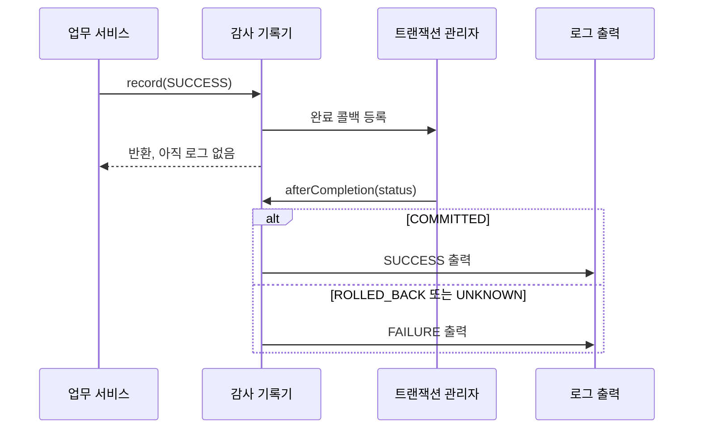

# 트랜잭션을 고려한 인증 감사 로그 구현과 설계 원칙

**감사 로그의 핵심은 문장을 출력하는 것이 아니라, 무엇을 언제 성공으로 기록할지 정의하는 것이다.** 특히 데이터베이스 변경이 포함된 작업에서는 서비스 코드가 끝난 시점과 실제 커밋이 끝난 시점을 구분해야 한다.

이 글은 Kotlin·Spring 기반의 `Slf4jAuthenticationAuditRecorder`가 `AuthenticationAuditRecorder`를 구현한 방식을 설명한다. 로그인, 비밀번호 변경, 사용자 역할 관리가 있는 일반적인 웹 서비스를 생각하면 된다. 프로젝트의 업무 지식은 필요하지 않다.

## 1. 감사 로그와 일반 로그의 차이

일반 HTTP 로그는 어떤 경로가 호출됐고 응답에 얼마나 걸렸는지 알려 준다. 감사 로그는 로그인, 비밀번호 변경, 권한 부여 같은 보안상 의미 있는 행동과 결과를 남긴다.

| 개념 | 의미 |
| --- | --- |
| 감사 이벤트 | 어떤 보안 행동을 누가 누구에게 수행했고 결과가 무엇인지 표현한 데이터 |
| 포트 | 애플리케이션이 외부 기능에 요구하는 인터페이스 |
| 어댑터 | 포트를 실제 기술로 구현한 코드 |
| SLF4J | 애플리케이션이 사용하는 로깅 API. 실제 출력은 연결된 로깅 구현과 설정이 담당 |
| 트랜잭션 | 여러 DB 변경을 함께 커밋하거나 롤백하는 처리 단위 |
| MDC | 현재 실행 문맥의 요청 식별자 등을 로그와 연결하는 저장 공간 |

이 사례의 감사 로그는 주요 인증·계정 작업을 추적하기 위한 운영 기록이다. 사용자 행동 전체를 재현하는 이벤트 저장소나 변경 불가능한 영구 증거 저장소를 구현한 것은 아니다.

## 2. 애플리케이션은 이벤트를 정의하고 어댑터는 출력 방법을 결정한다

애플리케이션이 의존하는 인터페이스는 하나의 메서드를 가진다.

```kotlin
fun interface AuthenticationAuditRecorder {
    fun record(event: AuthenticationAuditEvent)
}
```

이벤트에는 다음 정보만 들어 있다.

```kotlin
data class AuthenticationAuditEvent(
    val action: AuthenticationAuditAction,
    val result: AuthenticationAuditResult,
    val appUserId: Long? = null,
    val actorAppUserId: Long? = null,
    val targetAppUserId: Long? = null,
    val rolesBefore: Set<AppRole>? = null,
    val rolesAfter: Set<AppRole>? = null,
)
```

`action`은 `LOGIN`, `PASSWORD_CHANGE`, `USER_ROLES_REPLACE` 같은 enum이고, `result`는 `SUCCESS`, `FAILURE`, `REJECTED` 중 하나다. 호출자는 문자열 로그를 조립하거나 SLF4J를 직접 호출하지 않고 이 계약으로 사건을 전달한다.

`Slf4jAuthenticationAuditRecorder`는 `@Component`인 출력 어댑터다. SLF4J와 Spring 트랜잭션 동기화 API에 의존하는 부분을 이곳에 모았다. 애플리케이션 테스트에서는 포트를 대체해 어떤 이벤트가 요청됐는지 확인할 수 있고, 출력 형식은 어댑터 테스트에서 확인할 수 있다.

다만 같은 포트 구현을 DB 저장이나 외부 전송으로 바꾸더라도 동작 의미가 저절로 보존되지는 않는다. 기록 시점과 실패 처리, 내구성 계약까지 함께 정의해야 한다.

## 3. 성공 이벤트를 커밋 전에는 출력하지 않는다

사용자 역할을 변경했다고 가정해 보자.

```text
역할 변경 SQL 실행
  → 서비스에서 성공 로그 출력
  → 트랜잭션 커밋 실패
```

이 순서에서는 실제 역할이 바뀌지 않았는데 로그에는 성공이 남는다. 현재 구현은 성공 이벤트를 받았을 때 실제 트랜잭션과 동기화가 모두 활성화돼 있으면 출력 대신 완료 콜백을 등록한다.

```kotlin
if (
    event.result == AuthenticationAuditResult.SUCCESS &&
    TransactionSynchronizationManager.isActualTransactionActive() &&
    TransactionSynchronizationManager.isSynchronizationActive()
) {
    TransactionSynchronizationManager.registerSynchronization(
        object : TransactionSynchronization {
            override fun afterCompletion(status: Int) {
                val completedEvent =
                    if (status == TransactionSynchronization.STATUS_COMMITTED) {
                        event
                    } else {
                        event.copy(result = AuthenticationAuditResult.FAILURE)
                    }
                write(completedEvent)
            }
        },
    )
    return
}
write(event)
```

두 조건의 역할도 다르다. `isActualTransactionActive()`는 실제 트랜잭션의 존재를, `isSynchronizationActive()`는 현재 스레드에서 완료 콜백을 등록할 수 있는 상태인지를 확인한다. [Spring TransactionSynchronizationManager 문서](https://docs.spring.io/spring-framework/docs/6.2.x/javadoc-api/org/springframework/transaction/support/TransactionSynchronizationManager.html)

동작을 표로 정리하면 다음과 같다.

| 입력 이벤트와 실행 상태 | 출력 시점 | 출력 결과 |
| --- | --- | --- |
| SUCCESS + 실제 트랜잭션 + 동기화 활성 | 트랜잭션 완료 콜백 | 커밋이면 SUCCESS, 그 외 FAILURE |
| SUCCESS + 위 조건 미충족 | 즉시 | SUCCESS |
| FAILURE | 즉시 | FAILURE |
| REJECTED | 즉시 | REJECTED |

따라서 “모든 성공은 DB 커밋 후에만 기록한다”는 설명은 너무 넓다. **동기화 가능한 실제 트랜잭션 안에서 받은 성공 이벤트**에 적용되는 규칙이다. 트랜잭션이 필요한 작업이 실수로 트랜잭션 없이 실행돼도 이 기록기가 이를 강제하거나 복구해 주지는 않는다.

## 4. afterCommit 대신 afterCompletion을 선택한 이유

`afterCommit`은 커밋 성공에만 호출된다. 이 구현은 성공으로 전달된 이벤트가 롤백되면 실패 기록으로 남기려 하므로 완료 상태를 받는 `afterCompletion`을 사용한다. Spring은 커밋·롤백·결과 불명을 구분하는 상태 상수를 제공한다. [Spring TransactionSynchronization 문서](https://docs.spring.io/spring-framework/docs/6.2.x/javadoc-api/org/springframework/transaction/support/TransactionSynchronization.html)



여기에는 해석상의 한계도 있다. 현재 코드는 `STATUS_UNKNOWN`까지 `FAILURE`로 묶으므로 로그의 FAILURE가 항상 “DB 롤백이 확정됐다”는 뜻은 아니다. 운영상 구별이 필요하다면 완료 상태를 별도 필드로 남기는 방안을 검토할 수 있다.

또한 역할 변경이 롤백돼도 `rolesAfter`는 이벤트에 담긴 값 그대로 남고 `result`만 바뀐다. 실패 이벤트의 `rolesAfter`는 확정된 현재 권한이 아니라 시도한 변경값으로 읽어야 한다.

이 콜백은 현재 참여한 트랜잭션의 완료를 관찰한다. 중첩 저장점의 부분 롤백이나 독립적인 새 트랜잭션까지 한 작업의 결과로 묶으려면 추가 설계가 필요하다. 현재 구현이 모든 트랜잭션 전파 형태의 업무 결과를 자동으로 해석하는 것은 아니다.

## 5. 실패와 거절은 롤백돼도 관측할 가치가 있다

틀린 비밀번호로 로그인을 시도했다는 사실은 DB 변경이 커밋되지 않아도 남겨야 할 정보다. 요청 제한으로 차단된 행동도 마찬가지다. 현재 구현은 `FAILURE`와 `REJECTED`를 즉시 출력한다.

호출부는 의미 있는 완료 지점을 선택해야 한다. 실제 코드에서는 다음과 같이 역할을 나눈다.

- 인증 서비스는 자격증명 검증 실패를 기록한다.
- 로그인 컨트롤러는 세션과 보안 문맥 저장 단계까지 진행한 뒤 로그인 성공을 기록한다.
- 역할 관리 서비스는 변경 전후 역할과 행위자·대상을 담아 성공 이벤트를 전달한다. 실제 출력은 트랜잭션 완료까지 미뤄진다.
- 요청 제한 필터는 제한 초과를 `REJECTED`로 전달한다.

이 구분은 “비밀번호가 맞다”와 “로그인 처리를 끝냈다”가 서로 다른 관찰 지점임을 보여 준다. 다만 기록 이후 응답 전송이나 다른 저장 단계까지 모두 성공했다는 보장으로 확대하면 안 된다.

기록기는 전달받은 이벤트만 처리한다. 호출부가 정책 예외를 던지면서 이벤트를 전달하지 않았다면 자동으로 거절 로그를 만들지 않는다. 모든 보안 거절을 수집하려면 필요한 행동별로 호출 경로와 누락 범위를 점검해야 한다.

## 6. 로그 필드는 조회할 질문에 맞춰 설계한다

전용 로거 `com.icar.erp.security.audit`는 모든 이벤트를 INFO 레벨로 출력한다. 예시는 다음과 같다. 가독성을 위해 줄을 나눴지만 실제 메시지는 한 줄이다.

```text
event=AUTHENTICATION_AUDIT action=USER_ROLES_REPLACE result=SUCCESS
appUserId=9 requestId=example-request-id occurredAt=2026-09-22T01:00:00Z
actorAppUserId=7 targetAppUserId=9
rolesBefore=[RECEIVABLES] rolesAfter=[MANAGEMENT_SUPPORT, SYSTEM_ADMIN]
```

| 필드 | 답하려는 질문 |
| --- | --- |
| `event` | 어떤 종류의 로그인가? |
| `action`, `result` | 무슨 행동이 어떤 결과로 끝났는가? |
| `appUserId` | 어떤 사용자와 관련됐는가? |
| `actorAppUserId` | 누가 수행했는가? |
| `targetAppUserId` | 누구를 대상으로 했는가? |
| `rolesBefore`, `rolesAfter` | 역할 집합이 어떻게 바뀌었거나 바뀌려 했는가? |
| `requestId` | 어떤 요청·실행과 연결되는가? |
| `occurredAt` | 이 기록기가 언제 출력했는가? |

행위자와 대상은 특히 관리자 기능에서 중요하다. “사용자 9의 권한이 바뀌었다”만으로는 누가 바꿨는지 알 수 없다. 현재 역할 교체 호출은 두 값을 전달하지만, 모든 이벤트의 호출부가 이를 채우는 것은 아니다.

누락값은 `unknown`과 `none`으로 구별한다. 사용자 자체를 식별하지 못하면 `appUserId=unknown`, 적용되지 않는 역할 정보는 `none`이다. 실제 빈 역할 집합은 `[]`여서 “역할 정보가 없음”과 “역할을 모두 회수함”을 구분할 수 있다.

역할은 enum의 선언 순서인 `ordinal`로 정렬한다. 같은 역할 집합의 출력 순서를 안정화하지만 사전순은 아니고 enum 선언 순서가 바뀌면 출력도 달라질 수 있다.

SLF4J에는 `{}` 자리표시자와 인수를 전달한다. 이는 출력 템플릿과 값을 분리하는 방법이지, 임의의 입력에서 줄바꿈이나 민감정보를 자동 제거하는 장치는 아니다. 또한 현재 형식은 키-값을 가진 텍스트이며 JSON 구조화 로그는 아니다. 역할 목록에 공백이 있으므로 모든 값을 단순한 공백 분리로 파싱해서도 안 된다. [SLF4J 사용 설명](https://www.slf4j.org/manual.html)

## 7. 시각과 요청 식별자를 읽는 시점을 의식한다

`Clock`을 주입받아 `Instant.now(businessClock)`으로 시각을 생성한다. 테스트는 고정 시계를 사용해 정확한 UTC 시각을 확인한다.

현재 `occurredAt`은 `record()` 호출 시각이 아니라 `write()` 실행 시각이다. 트랜잭션 성공 이벤트는 완료 콜백 시점의 시각이 된다. 요청 시작, 업무 행동 발생, 커밋 완료, 로그 수집 시각이 모두 같은 것은 아니다. 각각 필요하다면 별도 필드로 구분해야 한다.

요청 식별자도 `write()`에서 `LoggingContext.requestId()`로 읽는다. 내부에서는 MDC를 사용한다. 일반적인 동기 HTTP 처리에서는 요청 로깅 필터가 식별자를 설정하고 작업 종료 후 복원한다. CLI도 `withRequestId` 같은 범위 지정 도구로 연결할 수 있다.

MDC는 스레드 문맥에 의존하므로 비동기 작업이나 스레드 풀로 옮길 때 자동 전파된다고 가정하면 안 된다. 감사 출력을 비동기로 바꾼다면 이벤트를 받는 시점에 식별자를 캡처하거나 명시적인 문맥 전파를 설계해야 한다. 스레드 재사용으로 이전 요청의 식별자가 남지 않도록 복원·정리도 필요하다. [Logback MDC 문서](https://logback.qos.ch/manual/mdc.html)

이벤트의 컬렉션도 마찬가지다. Kotlin의 읽기 전용 `Set` 타입이 깊은 불변성을 보장하지는 않는다. 지연 출력할 이벤트에는 변경 가능한 집합을 공유하지 말고 생성 시점의 스냅샷을 전달하는 편이 안전하다.

## 8. 민감정보는 출력 직전보다 이벤트 계약에서 제한한다

현재 이벤트에는 이메일, 전화번호, 비밀번호, 비밀번호 해시, 세션 ID, 쿠키, CSRF 토큰, 요청 본문을 담을 필드가 없다. 객체 전체를 직렬화하는 대신 허용한 필드만 출력한다.

이렇게 하면 호출자가 실수로 자격증명을 이벤트에 붙일 수 있는 표면을 줄인다. 내부 사용자 ID와 역할도 접근 통제가 필요한 정보이므로 “직접 식별자를 뺐으니 누구에게나 공개해도 된다”는 의미는 아니다.

새 필드를 추가할 때는 조사 목적, 민감도, 입력 출처, 보존 기간을 검토한다. 자유 입력 문자열이 필요하면 줄바꿈·구분자 처리와 로그 주입 방어도 필요하다. 비밀값은 출력 후 마스킹에만 의존하지 말고 가능한 한 수집하지 않는다. [OWASP Logging Cheat Sheet](https://cheatsheetseries.owasp.org/cheatsheets/Logging_Cheat_Sheet.html)

전용 로거 이름은 수집·조회 정책을 나누기 위한 기준이지만, 이름만으로 별도 저장소나 변경 방지 정책이 생기지는 않는다. 출력 레벨, 수집 경로, 접근 권한과 보존 설정이 실제로 연결돼야 한다.

## 9. 커밋 후 출력은 영구 기록 보장과 다르다

현재 구현은 “롤백된 작업을 성공으로 기록하지 않는다”는 목표를 돕는다. 하지만 DB 커밋과 SLF4J 출력은 하나의 원자적 저장이 아니다.

```text
DB 커밋 성공
  → 프로세스 종료 또는 로그 전달 실패
  → 성공한 변경의 감사 로그가 보존되지 않을 수 있음
```

이 클래스에는 내구성 큐, 전송 재시도, 이벤트 ID 기반 중복 제거, 변경 방지 저장 기능이 없다. `record()` 반환을 로그의 영구 보존 확인으로 해석해서는 안 된다.

또한 `afterCompletion`은 트랜잭션이 이미 끝난 단계다. Spring의 콜백 예외는 기록되고 호출자에게 전파되지 않는 계약이며, 여기서 실패했다고 이미 커밋한 업무를 롤백할 수 없다. 이곳에서 DB 감사 저장을 추가할 때도 원래 트랜잭션에 단순히 INSERT하면 안 된다. [완료 콜백 계약](https://docs.spring.io/spring-framework/docs/6.2.x/javadoc-api/org/springframework/transaction/support/TransactionSynchronization.html#afterCompletion(int))

강한 보존 요구가 있다면 성공한 업무 변경과 감사 레코드 또는 outbox 레코드를 같은 DB 트랜잭션으로 저장하고, 별도 전달기가 외부 저장소로 전송하는 방안을 검토할 수 있다. 재전송에 따른 중복 처리는 이벤트 ID 등으로 설계한다. [Transactional outbox 설명](https://docs.aws.amazon.com/prescriptive-guidance/latest/cloud-design-patterns/transactional-outbox.html)

다만 실패·거절 시도까지 같은 업무 트랜잭션에만 저장하면 롤백과 함께 사라질 수 있다. 성공한 상태 변경의 기록과 실패 시도의 기록은 내구성 요구와 저장 경로를 따로 판단해야 한다. outbox 역시 보존 기간이나 변조 방지 정책을 대신하지 않는다.

## 10. 현재 테스트와 보강할 검증

기록기 단위 테스트는 고정 시계와 출력 캡처를 사용하고, 트랜잭션 동기화 상태를 수동 설정해 콜백을 호출한다.

| 현재 테스트 | 확인한 내용 |
| --- | --- |
| 즉시 출력 | 행동·결과·사용자 ID·요청 ID·고정 시각 |
| 문맥 없음 | `appUserId=unknown`, `requestId=none` |
| 커밋 콜백 | 콜백 전 로그 없음, 커밋 후 SUCCESS |
| 롤백 콜백 | FAILURE로 변경되고 SUCCESS는 출력되지 않음 |
| 역할 변경 | 행위자·대상과 정렬된 전후 역할 집합 |

테스트 종료 후에는 트랜잭션 동기화 상태와 MDC를 정리한다. 이들은 테스트 사이에 남으면 다른 테스트의 결과를 바꿀 수 있는 실행 문맥이다.

이 단위 테스트는 콜백 분기와 출력 형식을 검증한다. 실제 DB 커밋 실패나 CloudWatch 수집, 프로세스 장애 시 보존까지 증명하지 않는다. 또한 민감정보 미포함 assertion만으로 모든 입력 경로의 정보 유출이 검증됐다고 볼 수 없다.

보장을 강화할 때는 다음을 추가로 확인할 수 있다.

- 실제 트랜잭션 관리자와 DB를 연결해 커밋·롤백 후 결과를 확인한다.
- `STATUS_UNKNOWN`, 트랜잭션 없음, 동기화만 활성인 상태를 검증한다.
- FAILURE와 REJECTED가 트랜잭션 완료 전에도 기록되는지 확인한다.
- 지연 출력 전 MDC나 입력 집합이 바뀌는 상황을 검증한다.
- 정책 거절과 예외 경로에서 이벤트 누락·중복이 없는지 확인한다.
- 로그 수준·수집 장애·보존 정책이 운영상 요구를 만족하는지 별도로 검증한다.

## 11. 적용할 설계 기준

1. 어떤 행동을 감사할지와 각 결과의 의미를 먼저 정의한다.
2. 애플리케이션은 사건을 표현하고, 어댑터가 출력 기술을 담당하게 한다.
3. 상태 변경의 성공은 실제 트랜잭션 결과와 연결한다.
4. 실패 시도는 상태 변경의 롤백과 구분해 기록한다.
5. 행위자·대상·요청 식별자·시각의 의미를 명시한다.
6. 민감정보를 이벤트 계약에 불필요하게 포함하지 않는다.
7. 완료 후 로그 출력과 내구성·변조 방지 보장을 구분한다.
8. 단위 테스트, 실제 트랜잭션 검증, 운영 수집 검증을 각각 수행한다.

## 12. 근거와 확인 범위

2026년 9월 22일 코드·테스트·운영 문서를 읽고 공식 자료를 확인했다. 아래 링크는 기준 커밋 `6a1963a31b1d9820b9d5baf87b9ac31a53b6f8dc`에 고정했다. 이번 작업에서는 애플리케이션을 수정하거나 테스트·운영 로그 수집을 다시 실행하지 않았다.

| 근거 | 확인할 내용 |
| --- | --- |
| [Slf4jAuthenticationAuditRecorder.kt](https://github.com/icar-mobility/icar-erp/blob/6a1963a31b1d9820b9d5baf87b9ac31a53b6f8dc/backend/src/main/kotlin/com/icar/erp/authentication/adapter/out/logging/Slf4jAuthenticationAuditRecorder.kt) | 트랜잭션 완료 분기와 로그 출력 |
| [AuthenticationAuditRecorder.kt](https://github.com/icar-mobility/icar-erp/blob/6a1963a31b1d9820b9d5baf87b9ac31a53b6f8dc/backend/src/main/kotlin/com/icar/erp/authentication/application/required/AuthenticationAuditRecorder.kt) | 포트·이벤트·행동과 결과 타입 |
| [AppUserAdministrationService.kt](https://github.com/icar-mobility/icar-erp/blob/6a1963a31b1d9820b9d5baf87b9ac31a53b6f8dc/backend/src/main/kotlin/com/icar/erp/authentication/application/service/AppUserAdministrationService.kt) | 역할 교체 시 행위자·대상과 전후 상태 전달 |
| [AuthenticationController.kt](https://github.com/icar-mobility/icar-erp/blob/6a1963a31b1d9820b9d5baf87b9ac31a53b6f8dc/backend/src/main/kotlin/com/icar/erp/authentication/adapter/in/web/AuthenticationController.kt) | 로그인 성공 기록 위치 |
| [LoggingContext.kt](https://github.com/icar-mobility/icar-erp/blob/6a1963a31b1d9820b9d5baf87b9ac31a53b6f8dc/backend/src/main/kotlin/com/icar/erp/shared/adapter/logging/LoggingContext.kt) | MDC 조회와 문맥 복원 |
| [기록기 테스트](https://github.com/icar-mobility/icar-erp/blob/6a1963a31b1d9820b9d5baf87b9ac31a53b6f8dc/backend/src/test/kotlin/com/icar/erp/authentication/adapter/out/logging/Slf4jAuthenticationAuditRecorderTest.kt) | 출력 형식과 커밋·롤백 콜백 검증 |
| [인증 감사 로그 운영 안내](https://github.com/icar-mobility/icar-erp/blob/6a1963a31b1d9820b9d5baf87b9ac31a53b6f8dc/docs/operations/authentication-audit-logs.md) | 기록 대상, 제외 정보와 운영 조회 방식 |

본문의 보강 방안은 현재 구현의 보장과 구분해 적용해야 한다. 이 기록기를 채택했다는 사실만으로 규제 준수나 감사 증거의 영구 보존이 완성되는 것은 아니다.
