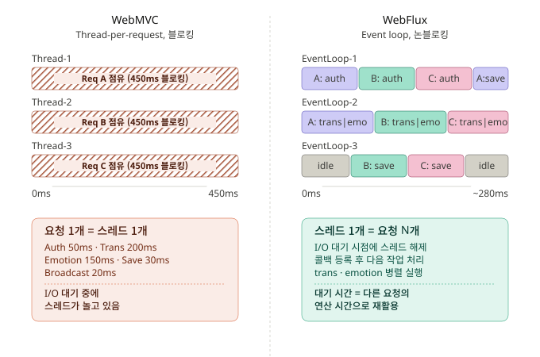
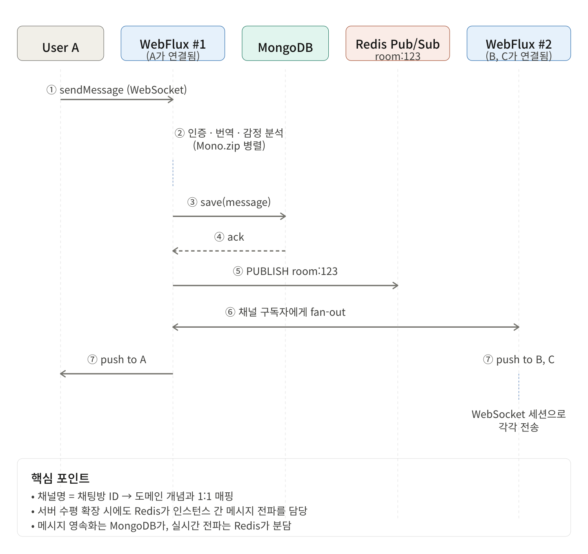

이번 포스팅에서는 특정한 비즈니스 상황 안에서 채팅 애플리케이션 아키텍처를 설계해보며, 다음과 같은 걸 배우는 것을 목표로 한다.
- 자본적인 limit을 가지고 고성능 애플리케이션을 만드는 방법
- 실시간 채팅 애플리케이션을 설계하는 방법

실제 업무에서 마주한 비즈니스 상황과 제약 안에서 설계를 진행했다. 글쓴이가 어떤 고민을 거쳐 어떤 판단을 내렸는지, 그리고 독자라면 같은 상황에서 어떤 다른 판단을 내릴 수 있을지 함께 생각해보며 읽으면 좋겠다.

---

## 비즈니스 상황과 제약
우리 회사는 해외 치과와 한국 기공소를 연결하는 B2B 플랫폼이다. 치기공물 의뢰는 의사와 기공소 간의 세밀한 소통을 필요로 하는데, 정작 컴플레인 대부분이 이 소통 과정에서 발생하고 있었다. 운영진이 여러 메신저 앱을 오가며 수동으로 대화를 추적하고 대응하는 방식에는 다음과 같은 한계가 있었다.

- **분산된 채널**: 운영진이 여러 채팅 앱을 번갈아 확인해야 함 
- **사적/업무 채팅 혼재**: 카카오톡 등에서 개인 대화와 섞여 관리 곤란 
- **언어 장벽**: 한국 기공사들의 영어 소통 어려움 
- **수동 팔로업의 확장성 한계**: 서비스 성장에 따른 인적 비용 증가

이를 해결하기 위해 (1) 모든 비즈니스 소통을 한 곳에서 관리하고, (2) 자동 번역으로 언어 장벽을 해소하며, (3) 대화에서 감정 신호를 감지해 컴플레인을 조기에 포착하는 **자체 채팅 애플리케이션**이 필요하다고 판단했다.
한편, 이후 모든 기술 선택에 영향을 준 두 가지 제약이 있었다.

- **인프라 비용 제한**: 작게 시작해 아웃풋을 검증하며 점진적으로 늘려야 함
- **1인 개발**: 백엔드 인원이 한 명이라 기술 부채와 운영 복잡도에 민감해야 함

---

## 애플리케이션 스택
사업은 초기 성장 단계로 비용을 최적화할 필요가 있었다. 그리고 인프라 비용을 최대한 아껴야 했기 때문에 **제한된 예산 내에서 사용자를 최대로 수용**하는 것을 중요한 목표로 설정했다.

또한, 메신저 서버(채팅 애플리케이션)의 도메인의 특성 상 동시 접속자 수가 많고 실시간 메시지 처리가 빈번하여 I/O 집약적 작업이 많다는 점도 선택 기준이 되었다.

### WebMVC의 처리 방식
전통적인 WebMVC 방식에서는 하나의 요청을 처리하는 동안 스레드가 **블로킹**되는 문제가 발생하여 I/O 집약적인 메신저 서비스에 부적합하다. 아래 예시를 통해 문제점을 자세히 살펴볼 수 있다.

```java
@RestController
public class MessageController {

    @PostMapping("/message")
    public ResponseEntity<String> sendMessage(@ResponseBody MessageRequest request) {
        // 1. 사용자 인증 - DB 조회 (평균 50ms 블로킹)
        User user = userService.authenticateUser(request.getToken());

        // 2. 번역 처리 - 외부 API 호출 (평균 200ms 블로킹)
        String translatedContent = translationService.translate(request.getContent());

        // 3. 감정 분석 - 외부 API 호출 (평균 150ms 블로킹)
        EmotionResult emotion = emotionService.analyze(request.getContent());

        // 4. 메시지 저장 - DB 저장 (평균 30ms 블로킹)
        Message message = messageService.saveMessage(request, translatedContent, emotion);

        // 5. 실시간 전송 - 웹소켓 브로드캐스트 (평균 20ms 블로킹)
        webSocketService.broadcastMessage(message);

        return ResponseEntity.ok("Message sent");
        // 총 450ms 동안 하나의 스레드가 블로킹
    }
}
```

- **자원 낭비**: 100개의 동시 요청 발생 시, 스레드 풀 크기(일반적으로 200개)의 절반이 점유되고, 컨텍스트 스위칭이 빈번하게 발생하여 대기 시간 동안 메모리와 CPU 자원이 낭비된다.

### WebFlux의 처리 방식
```java
public Mono<String> sendMessage(@RequestBody MessageRequest request) {
    return userService.authenticateUser(request.getToken())
            .flatMap(user -> Mono.zip(
                    translationService.translate(request.getContent()),
                    emotionService.analyze(request.getContent())
            ))
            .flatMap(tuple -> {
                String translation = tuple.getT1();
                EmotionResult emotion = tuple.getT2();
                return messageService.saveMessage(request, translation, emotion);
            })
            .flatMap(message -> webSocketService.broadcastMessage(message)
                    .thenReturn("Message sent"));
    // 스레드는 즉시 해제되어 다른 요청 처리 가능
} 
```

WebFlux는 **논블로킹 방식**으로 I/O 작업을 처리하여 스레드 활용 효율을 극대화하고, 메신저 서비스의 높은 동시성 요구사항을 충족한다.

- **효율적인 스레드 활용**: I/O 대기 시간 동안 스레드가 다른 작업을 처리할 수 있어 스레드 풀을 효율적으로 활용한다.
- **성능 향상**: 번역과 감정 분석을 병렬 처리해 처리 시간을 단축한다 (다이어그램 참고).
- **높은 동시성 처리**: 적은 수의 스레드로도 수천 개의 동시 요청을 처리할 수 있다.

### WebMVC와 WebFlux의 일반적인 성능 경향

두 방식이 동일한 비즈니스 로직을 처리할 때 시간 축에서 어떻게 다르게 흘러가는지 비교하면 다음과 같다.



핵심은 WebFlux가 동일 하드웨어에서 더 적은 자원으로 더 많은 동시 요청을 처리할 수 있다는 구조적 경향이다.  
채팅 도메인은 메시지 저장, 외부 번역/감정 분석 API 호출, 웹소켓 브로드캐스트 등 I/O 작업의 비중이 절대적으로 높아 이 경향이 가장 잘 발휘되는 워크로드라고 판단했다.

### 채팅 도메인과의 적합성
채팅 도메인이 갖는 특성인 실시간성과 높은 동시성을 고려할 때, WebFlux는 다음과 같은 이점을 제공한다.
- **웹소켓 연결 관리**: WebFlux는 논블로킹 I/O를 통해 수천 개의 웹소켓 연결을 효율적으로 관리할 수 있다.
- **메시지 브로드캐스팅**: 대량의 메시지 전송 시에도 스레드 블로킹 없이 처리할 수 있다.
- **외부 API 통합**: 번역/감정 분석 API 호출과 같은 외부 연동 시 블로킹 없는 병렬 처리를 지원한다.

결론적으로 I/O 집약적 작업에서의 강력함, 동시적으로 많은 요청을 처리할 수 있는 능력, 거기에 비용 절감까지 노릴 수 있기 때문에 웹 기반 스택으로 WebFlux를 채택하였다.

### 더하는 말

추가적으로, WebMVC와 WebFlux의 [아키텍처 설계 철학을 포함한 세부적인 비교](https://jewoodev.github.io/posts/WebMVC_vs_WebFlux/) 또한 진행했다. 해당 내용도 확인하고 싶다면 링크를 클릭하여 확인해주길 바란다.

---

## DB 스택
데이터베이스를 선택하는 기준에서도 비용 효율성과 확장성이 가장 중요하게 고려할 사항이었다.  
거기에 더해 애플리케이션의 기반인 WebFlux와의 **기술적 시너지**와 채팅 도메인의 **데이터 특성**도 함께 고려해서 RDBMS(PostgreSQL), NoSQL(MongoDB), Cassandra(ScyllaDB) 세 가지 옵션을 비교 분석했다.

채팅 도메인의 데이터 특성은 다음과 같이 정의하였다.
- **쓰기 중심**: 메시지 생성이 조회보다 빈번
- **시간순 데이터**: 메시지는 시간 순으로 저장되고 조회됨
- **비정형 데이터**: 텍스트, 이미지, 파일 등 다양한 메시지 타입
- **급격한 데이터 증가**: 사용자 증가에 따른 메시지량 폭증
- **실시간성**: 낮은 지연시간 요구

### RDBMS 후보군 정리
RDBMS 제품군 중 Oracle은 라이선스 비용, SQL Server는 Linux/Java 환경과의 적합성, SQLite는 임베디드 DB라는 특성 때문에 처음부터 후보에서 제외되었다. 현실적인 후보는 MySQL/MariaDB와 PostgreSQL 두 갈래였다.  
둘 중에서는 PostgreSQL을 선택했다. MySQL은 InnoDB의 Next-Key Lock으로 인한 락 경합과 Undo Log 기반 MVCC의 오버헤드로 시간순 INSERT가 집중되는 채팅 워크로드에서 불리한 특성이고, PostgreSQL은 팬텀 리드를 MVCC 스냅샷으로 처리해 이 문제에서 자유롭다. JSONB나 파티셔닝 같은 부가 기능에서도 PostgreSQL이 더 풍부한 선택지를 제공한다.

### PostgreSQL
```sql
-- PostgreSQL에서의 메시지 저장 구조
CREATE TABLE messages (
    id BIGSERIAL PRIMARY KEY,
    chat_room_id UUID NOT NULL,
    user_id UUID NOT NULL,
    content JSONB NOT NULL, -- 메시지 내용을 JSONB로 저장 가능
    message_type VARCHAR(50) NOT NULL,
    created_at TIMESTAMP DEFAULT NOW()
);

CREATE INDEX idx_chat_room_time ON messages(chat_room_id, created_at);

-- 메시지 조회 시 복잡한 쿼리 필요
SELECT m.*, u.name as username
FROM messages m 
JOIN users u ON m.user_id = u.id
WHERE m.chat_room_id = ? -- ?에 조회하려는 채팅방 기입
ORDER BY m.created_at DESC
LIMIT 50;
```

PostgreSQL은 비용 측면은 만족하지만, 채팅 도메인의 데이터 특성과는 거리가 있다. 정규화 기반 모델링은 채팅 메시지처럼 다양한 타입과 중첩 구조를 가진 비정형 데이터를 다루기에 자연스럽지 않고, 메시지 조회 시 사용자 정보 등을 가져오기 위한 JOIN 연산이 빈번하게 필요하다. JSONB로 일부 보완은 가능하지만, 도메인 모델 자체가 문서 지향적인 채팅에서는 MongoDB의 임베디드 구조가 더 적합하다.  
확장성 측면에서도 PostgreSQL은 Declarative Partitioning과 Citus 같은 확장을 통해 분산 구성이 가능하지만, MongoDB처럼 내장된 자동 샤딩 기능을 제공하지는 않아 운영 복잡도가 상대적으로 높다.

### Cassandra(ScyllaDB)
Cassandra는 초고성능 메시지 처리가 가능하지만, 1인 개발 체제와 비용 제약을 고려할 때 클러스터 운영 부담과 CQL 학습 곡선이 과도한 선택이었다. 현재 단계에서는 오버엔지니어링이라 판단했다.

### MongoDB
#### 채팅 도메인의 데이터 특성과 MongoDB 모델링
MongoDB의 임베디드 구조 기반 데이터 모델링은 정규화를 필요로 하지 않아 JOIN 연산없이 모든 데이터를 조회한다.  
JOIN 연산을 없앨 뿐만 아니라 **데이터 지역성**의 차이로 **성능이 크게 향상**되는 결과로 이어진다.  

```javascript
{
    _id: ObjectID("..."), // 시간 정보 포함
    chatRoomId: "room_123",
    userId: "user_123",
    userName: "김철수",
    content: {
        type: "text",
        text: "안녕하세요",
        translation: "Hello"
    },
    emotion: {
        sentiment: "positive",
        confidence: 0.85
    },
    createdAt: ISODate("2024-01-15T10:30:00Z")
}

// 단순한 조회
db.messages.find({ chatRoomId: "room_123" })
        .sort({ _id: 1 })
        .limit(50);
```
채팅 메시지는 **시간순 조회**가 주요 패턴인데, MongoDB의 ObjectId가 시간 정보를 포함하므로 별도의 인덱스 없이 효율적인 시간순 정렬이 가능하다는 점도 채팅 도메인과 적합하다.

#### WebFlux와의 시너지

마지막으로, "WebFlux와의 시너지는 어떤 게 더 좋은가?"의 관점에서 살펴보면, MongoDB Reactive Streams Driver는 처음부터 리액티브 스트림 사양에 맞춰 설계되어 요청부터 응답까지 전체 스택을 논블로킹으로 일관되게 구성할 수 있다.  
PostgreSQL도 R2DBC를 통해 비동기 API를 사용할 수 있지만, 성숙도와 생태계 면에서 MongoDB 대비 아직 제한적이다. 예를 들어 R2DBC는 JDBC 대비 지원되는 기능과 도구의 폭이 좁고, 트랜잭션 처리나 커넥션 풀 구현체의 안정성 측면에서도 상대적으로 검증 기간이 짧다.

이러한 논리들에 기반하여 MongoDB를 DB 스택으로 채택하였다.

#### 더하는 말

추가적으로, [RDBMS보다 MongoDB가 대용량 데이터 처리에 왜 더 뛰어난 성능을 보이는지](https://jewoodev.github.io/posts/MongoDB%EC%9D%98_%EC%84%B1%EB%8A%A5%EC%9D%B4_RDBMS%EB%B3%B4%EB%8B%A4_%EB%9B%B0%EC%96%B4%EB%82%9C_%EC%9D%B4%EC%9C%A0/)에 대한 고찰 또한 진행하였다. 해당 내용도 확인하고 싶다면 링크를 클릭하여 확인해주길 바란다.

---

## 이벤트 브로커 스택
이벤트 브로커 선택에서도 비용과 확장성은 동일한 기준으로 두었다. 다만 앞서 WebFlux와 MongoDB처럼 러닝 커브가 있는 스택들을 채택했기 때문에, 이번에는 **개발 및 운영 복잡도 최소화와 빠른 개발 속도를 더 중요한 기준**으로 설정했다. 여기에 메신저 도메인의 실시간 특성을 더해, Redis Pub/Sub, RabbitMQ, Apache Kafka 세 가지를 비교 분석했다.

이러한 전제 하에서 채팅 애플리케이션의 메시지 브로커 요구사항을 다음과 같이 정의하였다.

- **실시간 메시지 전파**: 채팅방 내 참여자들에게 즉시 전달 
- **낮은 지연 시간**: 실시간 채팅의 사용자 경험을 보장할 수 있는 응답 속도 
- **개발 복잡성 최소화**: 초기 서비스 단계에서의 빠른 구현 
- **운영 부담 최소화**: 작은 개발팀에서 관리 가능한 구조 
- **메시지 지속성 불필요**: 채팅 히스토리는 별도 DB에 저장 
- **초기 사용자 규모**: 예상 동시 접속자 수 10,000명 이하

### Apache Kafka
Kafka는 대용량 스트리밍 처리에 강점이 있지만, 현재 단계에서는 오버스펙이었다. ZooKeeper/KRaft 설정과 파티션 설계, 토픽/오프셋 관리 등 운영과 개발 양쪽에서 1인 체제가 감당하기 어려운 복잡도가 발생한다. 또한 메시지 영속화는 채팅 도메인에서 핵심 요구사항이 아니라, Kafka의 가장 강력한 장점이 이 시스템에서는 활용되지 않는다.

### RabbitMQ
RabbitMQ는 메시지 전달 보장 측면에서 견고한 선택지지만, 별도 인프라 구축과 Exchange/Queue/Binding 같은 라우팅 개념의 학습 비용이 부담이었다. 무엇보다 ACK/NACK 기반의 메시지 전달 보장은 현재 요구사항(채팅 히스토리는 별도 DB에 저장)에서 핵심 가치가 아니다. 이후 사용자 규모가 커지거나 메시지 보장이 중요해지는 시점이 오면 마이그레이션 후보로 다시 검토할 가치가 있다.

### Redis Pub/Sub
#### 요구사항 적합성 분석
Redis Pub/Sub의 인메모리 기반 구조는 메신저 서비스의 실시간 특성에 최적화되어 있다. 그리고 채널 기반의 간단한 구조는 '채팅방' 이라는 도메인 개념과 직관적으로 매핑되어 자연스럽게 구현할 수 있게 한다.  

또한, 메시지 지속성이 불필요한 현재 요구사항에서 Redis Pub/Sub의 특성이 오히려 장점으로 작용하여 불필요한 오버헤드를 제거한다.

#### 기존 Redis 인프라와의 연계
채팅 시스템 설계 기반에 세션 관리와 캐싱 관리 역할 또한 필요하다.  
Redis Pub/Sub은 기존 Redis 인프라를 활용해 별도의 추가 인프라 없이 그러한 역할까지 겸할 수 있다.  
이는 인프라 비용 절감과 운영 복잡성 최소화라는 현재 단계의 **목표와 잘 부합했다**.  

#### 개발 및 운영 복잡도
Redis Pub/Sub은 단순한 API를 제공한다.  
`PUBLISH`, `SUBSCRIBE`, `PSUBSCRIBE` 등 몇개의 명령어만으로 실시간 메시징을 구현할 수 있어 개발 속도가 매우 빠르다. 복잡한 설정이나 스키마 정의 없이 즉시 사용 가능하며, 모니터링도 기존 Redis 모니터링 도구를 그대로 활용할 수 있다.  

장애 상황에서도 Redis 재시작만으로 간단하게 복구되며, 클라이언트는 재연결만 하면 되는 단순한 구조다.

#### 성능 특성
매우 낮은 지연 시간을 제공하여 사용자가 체감하는 실시간성을 보장한다.   
현재 목표인 10,000명의 동시 접속자 처리에 충분한 성능을 제공하며, 메모리 기반 처리로 높은 처리량을 보장한다.  
채팅 도메인의 특성상 메시지 손실이 치명적이지 않고, 클라이언트 레벨에서 간단한 조회 또는 재전송 로직으로 보완 가능하다.

이러한 이유들로 현재 비즈니스 단계에서 Redis Pub/Sub을 채택하였다.

실제로 메시지 하나가 전송될 때 시스템이 어떻게 협력하는지 살펴보면, Redis Pub/Sub의 채널 모델이 채팅방 도메인과 어떻게 맞물리는지 더 분명하게 드러난다.



특히 주목할 점은 같은 채팅방의 유저들이 서로 다른 WebFlux 인스턴스에 연결되어 있을 때, Redis가 인스턴스 간 메시지 중계자 역할을 한다는 것이다. 이 구조 덕분에 서버를 수평 확장해도 채팅방의 메시지 전파가 자연스럽게 유지된다.


#### 확장성 한계와 마이그레이션 전략
Redis Pub/Sub의 수평 확장성의 한계를 인지하고 있으며, 다음과 같은 마이그레이션 전략을 수립했다.
- **동시 접속자 50,000명 초과 시**: RabbitMQ 클러스터링으로 마이그레이션
- **메시지 전달 보장이 중요해질 때**: RabbitMQ의 ACK 메커니즘 활용 
- **대규모 분산 환경 필요시**: Apache Kafka로 최종 마이그레이션

현재 단계에서는 개발 속도와 운영 단순성이 확장성보다 우선순위가 높으며, 필요 시점에 점진적으로 마이그레이션하는 전략이 비즈니스 목표라고 설정했다.

> Redis Pub/Sub이 처리할 수 있는 동시 접속자 수: 기본적으로 10,000 명 ([참고 문헌](https://stackoverflow.com/questions/59873784/valkey-redis-pub-sub-max-subscribers-and-publishers))

---

## 마무리하며
여기까지 특정한 상황에서 필요한 프로덕트를 고안하고 그 프로덕트의 복잡성, 비용, 생산성의 기준을 산정하여 아키텍처를 설계해보았다.  

이 애플리케이션은 초기 단계에서는 단일 인스턴스로 시작해, 필요한 시점에 점진적으로 스케일 아웃할 수 있는 구조로 설계했다. 더 세부적으로는 PostgreSQL로 시작했다가 MongoDB로 마이그레이션하는 단계적 전략도 가능한 선택지였지만, 1인 개발 체제에서 마이그레이션 작업의 비용을 고려하면 처음부터 MongoDB를 채택하는 쪽이 더 합리적이라고 판단했다.

개발자로서 어떤 판단을 내릴 땐 "항상 정답은 없다."는 생각으로 고민을 거듭하지만 그 속에서 가장 정답에 가까운 답을 찾아내는 걸 목표로 하게 된다. 그 과정이 고단하기도 하지만 동시에 즐겁기도 하다. 그 과정에 이 글이 독자의 힘이 되기를 바라며 글을 마치겠다. 
